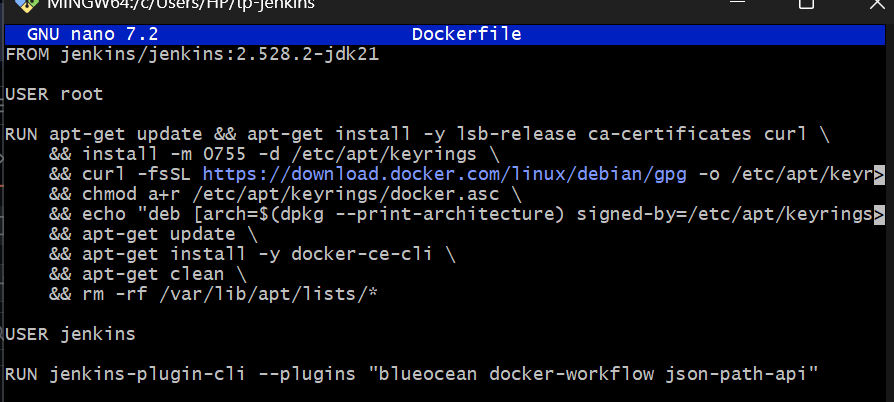

# Java Pipeline — Jenkins & Maven

> **Auteur :** Niema El Malki    
> **Num. Inscription:** SMI0157/25    
> **Dépôt :** [TPJavaPipeLine-Niema_El_Malki](https://github.com/niemaelmalki/TPJavaPipeLine-Niema_El_Malki)  
> **Forké depuis :** [simoks/java-maven-ensi](https://github.com/simoks/java-maven-ensi)

---


## Mise en place de Jenkins via Docker
### Création de Dockerfile 



###  Build de l'image Jenkins personnalisée

Une image Docker `myjenkins` est construite depuis un `Dockerfile` embarquant Jenkins avec Docker CLI et les plugins nécessaires (BlueOcean, docker-workflow).

```bash
docker build -t myjenkins .
```


---

### Démarrage du conteneur Jenkins

```bash
docker run -d --name jenkins \
  -p 8080:8080 -p 50000:50000 \
  --name jenkins myjenkins
```


---

### Installation des plugins Jenkins

Après accès à `http://localhost:8080`, Jenkins installe automatiquement les plugins recommandés : Pipeline, Git plugin, GitHub Branch Source, Credentials Binding, Email Extension, etc.


---

### Récupération du mot de passe initial

```bash
docker exec jenkins cat //var/jenkins_home/secrets/initialAdminPassword
```

> Sur Windows avec Git Bash (MinGW), le double slash `//var/...` est nécessaire pour éviter la conversion automatique du chemin.


---

### Création du compte administrateur Jenkins

Un compte administrateur est créé avec les informations suivantes :

- **Nom d'utilisateur :** angeeel66
- **Nom complet :** Niema El Malki
- **Email :** niemaelmalki7@gmail.com


 ---


### Création du job `pipelineJava` (Pipeline simple)

En parallèle, un job de type **Pipeline** simple nommé `pipelineJava` est également créé pour tester le pipeline manuellement.


---
### Configuration SCM Git du `pipelineJava`

- **SCM :** Git
- **Repository URL :** `https://github.com/niemaelmalki/TPJavaPipeLine-Niema_El_Malki`
- **Branch Specifier :** `*/main`


---

## Problèmes rencontrés et solutions

###  Problème 1 — Socket Docker absent, image inaccessible

**Symptôme :** Jenkins ne peut pas communiquer avec le daemon Docker. L'image `my-maven-git:latest` est inaccessible.

**Cause :** Le socket `/var/run/docker.sock` n'était pas monté dans le conteneur Jenkins au premier lancement.

**Solution :** Arrêter, supprimer, et relancer le conteneur avec le socket monté :

```bash
docker stop jenkins
docker rm jenkins
docker run -d --name jenkins \
  -p 8080:8080 -p 50000:50000 \
  -v jenkins_home:/var/jenkins_home \
  -v //var/run/docker.sock:/var/run/docker.sock \
  myjenkins
```


---

###  Problème 2 — `permission denied` sur le socket Docker

**Symptôme :**
```
permission denied while trying to connect to the Docker daemon socket
at unix:///var/run/docker.sock
```

**Cause :** L'utilisateur `jenkins` n'avait pas les droits d'accès au socket Docker.

**Solution :** Entrer dans le conteneur en `root` et corriger les permissions :

```bash
winpty docker exec -u root -it jenkins bash
groupadd docker || true
usermod -aG docker jenkins
chmod 666 /var/run/docker.sock
exit
docker restart jenkins
```


---

###  Pipeline réussi après correction — Build #6

Après résolution des deux problèmes, le build **#6** s'exécute avec succès en **14 secondes** :

- Lancé par : **Niema El Malki**
- Dépôt : `https://github.com/niemaelmalki/TPJavaPipeLine-Niema_El_Malki`
- Branche : `refs/remotes/origin/main`


---


### Inscription sur ngrok

Pour que GitHub puisse envoyer des Webhooks vers Jenkins tournant en local, **ngrok** crée un tunnel HTTPS public vers `http://localhost:8080`.


### Récupération de l'Authtoken


---
###  Lancement du tunnel ngrok
```bash
ngrok config add-authtoken <votre_token>
```
```bash
ngrok http 8080
```

URL publique générée :  
**`https://phrase-hypnoses-impaired.ngrok-free.dev`** → `http://localhost:8080`


---

## Configuration du Webhook GitHub

Dans les paramètres du dépôt : **Settings → Webhooks → Add webhook**


---

### Webhook actif — Livraison réussie ✅


---
### Création du job `TPJava-Pipeline` (type Multibranches)

Dans Jenkins → **Nouveau Item**, le nom `TPJava-Pipeline` est saisi et le type **Pipeline Multibranches** est sélectionné.


---
### Configuration de la source Git (Branch Sources)

- **Project Repository :** `https://github.com/niemaelmalki/TPJavaPipeLine-Niema_El_Malki`
- **Credentials :** aucun (dépôt public)
- **Behaviours :** Discover branches

Jenkins scanne le dépôt, détecte la branche `main` qui contient un `Jenkinsfile`, et crée automatiquement un pipeline pour elle.


---
## Pipeline Multibranches réussi

Jenkins a automatiquement détecté la branche `main`, lu le `Jenkinsfile` à sa racine, et exécuté le pipeline avec succès.


